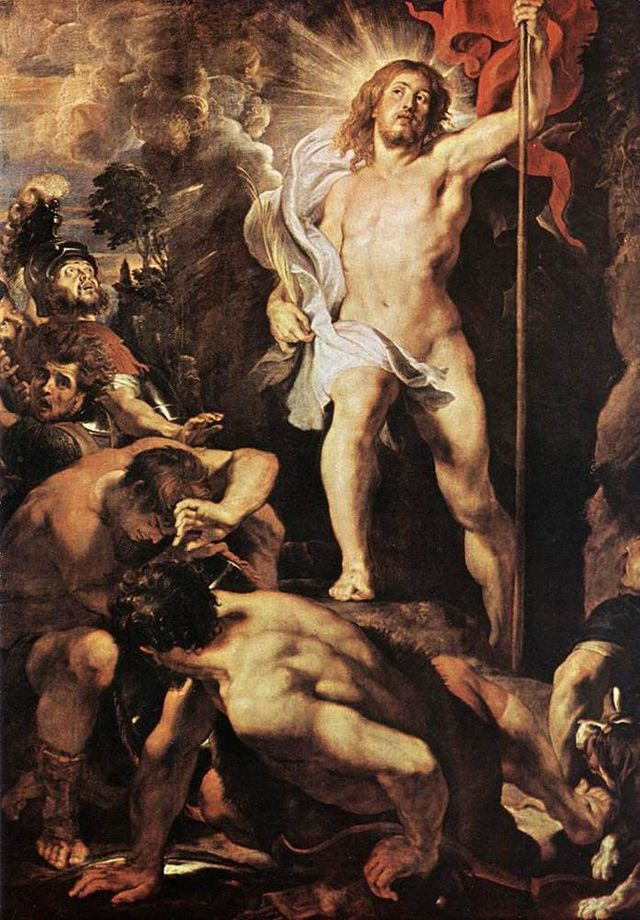

##

## Romans 11:33-36

<br>
```
"Oh, the depth of the riches and widsom and knowledge of God! 
How unsearchable are his judgements and how inscrutable his ways!

'For who has known the mind of the Lord, 
or who has been his counselor?'

'Or who has given a gift to him that he might be repaid?'

For from him and through him and to him are all things. 
To him be glory for ever. Amen."
```

## 

###What do we learn about God?

#### Depths

<div id="col_left">

- Riches
- Wisdom
- Knowledge

</div>

<div id="col_right">

- Given a gift to him
- Knows his mind
- Been his counselor

</div>

<div id="midcenter">
<div id="footer_65">

<small>*Trumph of St. Ignatius of Layota*<br> Andrea Ponzo **(1642)**</small>
</div>
</div>

## 
###How does this ultimately point to Jesus?

<div id="shrink"></div>
<small>*Resurrection of Jesus* <br> Peter Paul Rubens **(1611)**</small>

##
### What did you find surprising or unexpected?


##
### What is God Saying to You?
